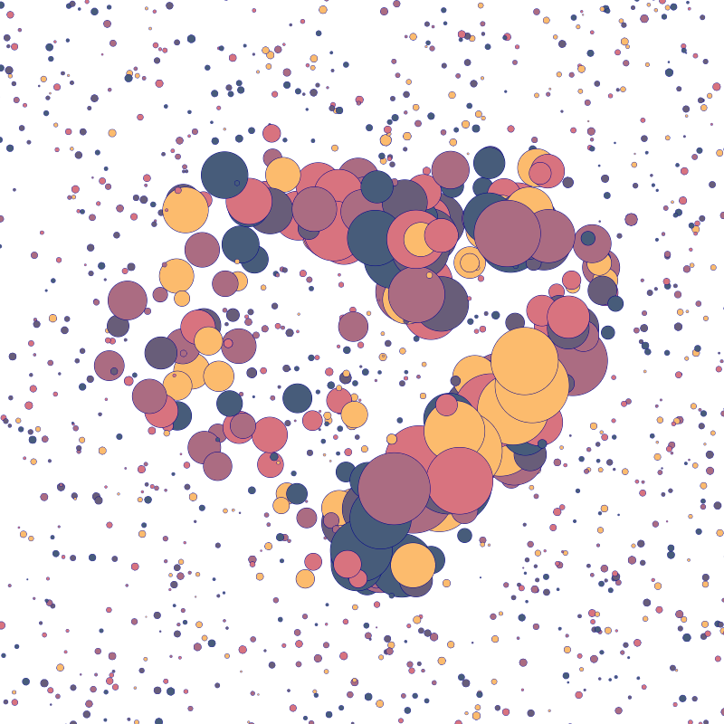
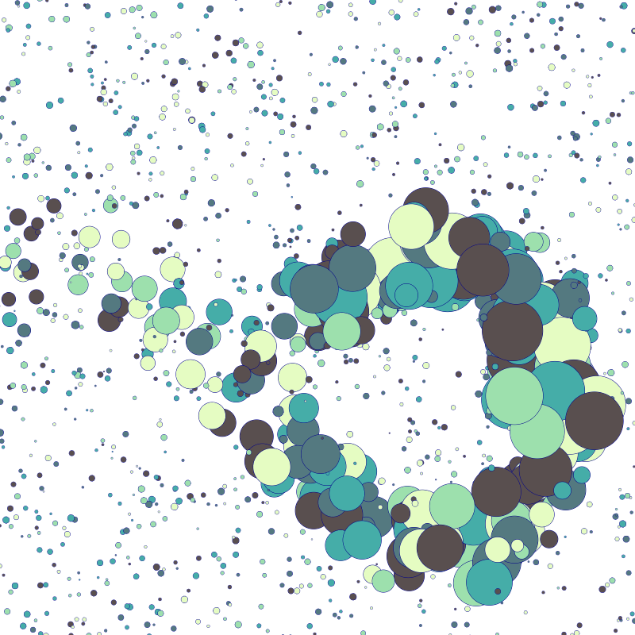
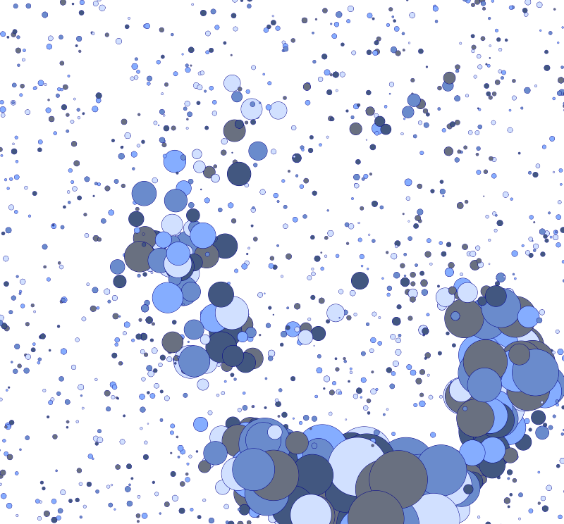
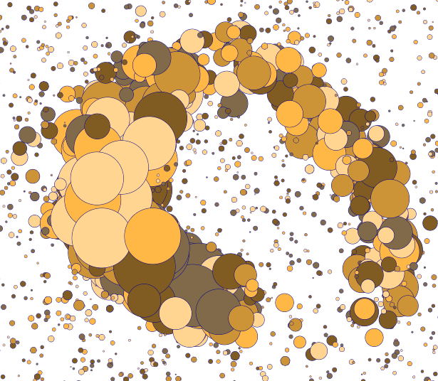

# canvasFloatingCircles

easyToLearn canvas animation with JS, to generate more floating circles use **scrollwheel** and to change the colour palette simply **leftClick** on the screen

Note: Keep the project file structure

You can preview this project [here](https://fipie.github.io/canvasFloatingCircles/)

 

 

